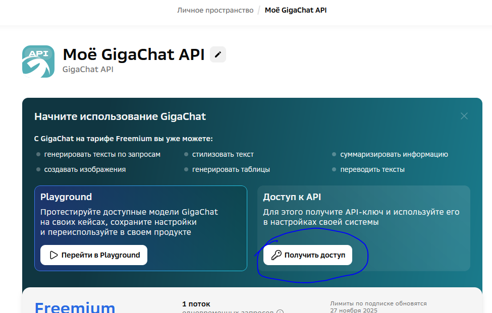
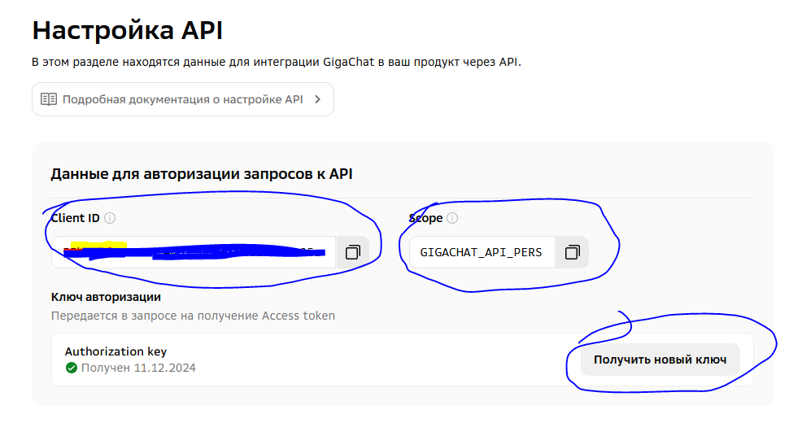

Распознавание текста из картинки с помощью гигачата от сбербанка

Этот проект представляет собой сервис, который помогает пользователям заполнять загружать файлы в гигачат и распознавать их.

Установка
Для начала, вам нужно установить зависимости, необходимые для работы сервиса.
Клонируйте репозиторий:

    git clone https://github.com/stds58/GigaChat_foto_in_tekst.git

в личном кабинете https://developers.sber.ru/studio/registration получите ключи

создайте файл .env и поместите в него постоянные, взятые из личного кабинете:

    TOKEN_GIGACHAT = Client ID
    CLIENT_SECRET = Authorization key

в папке certificate лежат сертификаты минцЫфры. если код работать не будет, установите их на компьютер с помощью команды
(руководство https://www.gosuslugi.ru/crt)

    python -m pip install certifi

установите зависимости

    pip install -r requirements.txt

Работа
в файле gigachat.promt.py установите пользовательские переменные

    FOTO_PATH = 'путь к файлу jpeg'
    CONTENT =  "запрос гигачату. например, Распознай весь текст в этом снимке.Покажи только этот текст в формате json."

запустите файл gigachat.promt.py

не забудьте поставить звёздочку репозиторию))
спасибо!

